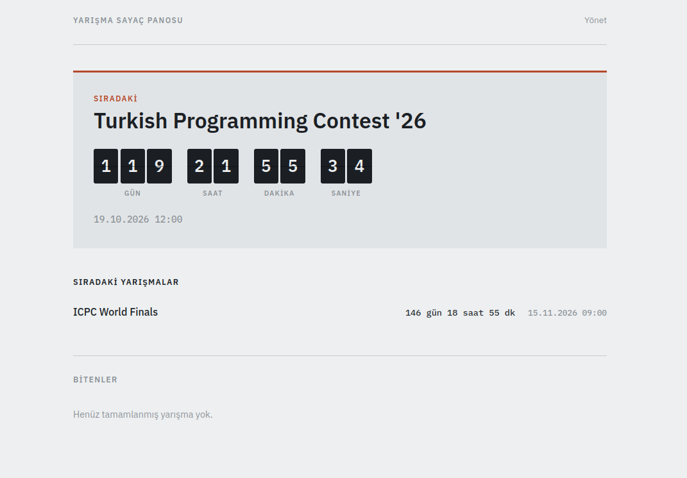

# Yarışma Sayaç Panosu

Manuel olarak girilen bilgilerin sunucu tarafında saklandığı global bir veritabanı üzerinden, bir sonraki yarışmaya kalan süreyi gösteren sayfa.

Live: [https://yarisma-sayac.netlify.app/](https://yarisma-sayac.netlify.app/)

---

---

## Özellikler

- En yakın yarışma gün / saat / dakika / saniye sayacıyla öne çıkar
- Diğer yaklaşan yarışmalar liste halinde en yakından uzağa sıralanır
- Tarihi geçen yarışmalar altta "Bitenler" olarak görünür
- Veri **Netlify Blobs**'ta tutulur — her cihaz/tarayıcı aynı listeyi görür
- Admin paneli şifre korumalıdır (SHA-256 tabanlı)

